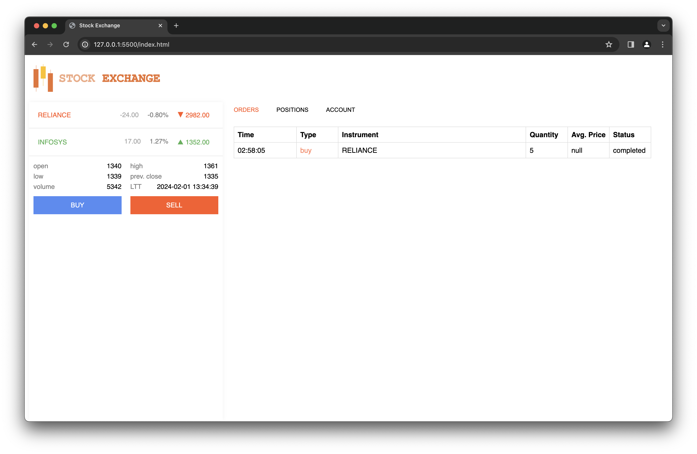

# Stock Exchange Project

## Introduction

This project is a stock exchange system built with Node.js for the backend, HTML/CSS for the frontend, and MongoDB for the database. The main highlight of this project is the order matching algorithm, which efficiently matches buy and sell orders according to specified criteria. Express.js is used to handle API calls, providing seamless communication between the frontend and backend components.

## Features

- Order matching algorithm: Implements a sophisticated algorithm to match buy and sell orders efficiently.
- Express.js API: Uses Express.js to create robust APIs for seamless communication.
- MongoDB integration: Utilizes MongoDB as the database to store and manage stock exchange data.
- Frontend interface: Provides a user-friendly frontend interface built with HTML/CSS for traders to interact with the stock exchange.

## Screenshots

*Caption for Screenshot 1*

*Caption for Screenshot 2*

## Demo Video

*Click the image above to watch the demo video*

Usage
Visit the homepage to view the available stocks and place buy/sell orders.
Explore the various features and functionalities provided by the stock exchange system.

Contributing
Contributions are welcome! Please feel free to submit a pull request or open an issue to report bugs or suggest improvements.

License
This project is licensed under the MIT License.
